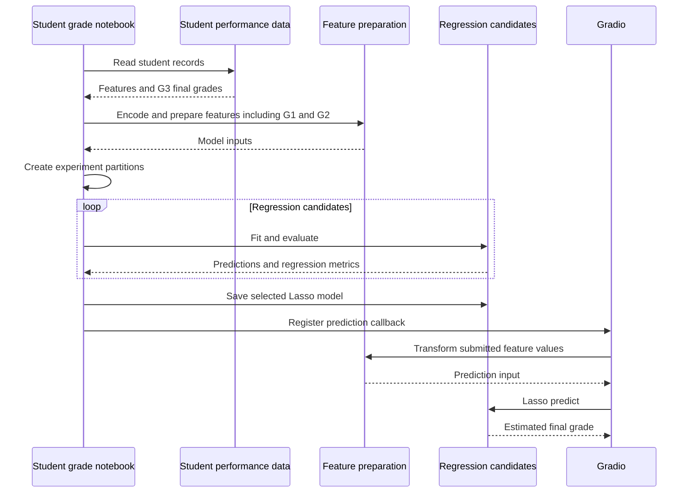

# Student Final Grade Prediction

A student performance regression notebook that compares models for predicting the final grade `G3` and includes an interactive Gradio example.

**Technology:** Python · scikit-learn · XGBoost · pandas · Gradio

## Features

- Analyze student demographics, study habits, prior grades, and final-grade relationships.
- Compare Linear Regression, Ridge, Lasso, Random Forest, Gradient Boosting, and XGBoost.
- Evaluate regression predictions with error metrics and R².
- Provide a Gradio form using a saved Lasso model.

## Repository guide

| Path | Purpose |
|---|---|
| [student-final-grade-prediction.ipynb](student-final-grade-prediction.ipynb) | EDA, model comparison, export, and interface cells. |
| [student-mat.csv](student-mat.csv) | Student performance dataset. |
| [Lasso Regression.pkl](Lasso%20Regression.pkl) | Saved Lasso model. |

## Requirements and current limitations

Update the Kaggle dataset path to `student-mat.csv` and the Gradio model path to the included `Lasso Regression.pkl`. The form includes first- and second-period grades (`G1`, `G2`), so its use assumes these values are already available. Preserve the training encodings when using the saved model.

The Gradio interface lives in the notebook; no separate Streamlit application is included.

## UML diagrams

### Main workflow

The notebook compares regression models and connects the selected Lasso predictor to a Gradio interface. Earlier grades G1 and G2 are available as predictors.



## Getting started

```bash
git clone https://github.com/IbrahimAbdelsattar/Student-Final-Grade-Prediction.git
cd Student-Final-Grade-Prediction
```

Use a Python virtual environment:

```bash
python -m venv .venv
```

Activate it with `source .venv/bin/activate` on macOS/Linux or `.venv\Scripts\Activate.ps1` in PowerShell.

```bash
python -m pip install jupyter pandas numpy matplotlib seaborn plotly scikit-learn xgboost joblib gradio
python -m jupyter notebook
```

Open the notebook listed above and run its cells in order. Adjust dataset and model paths as described in the limitations section.
