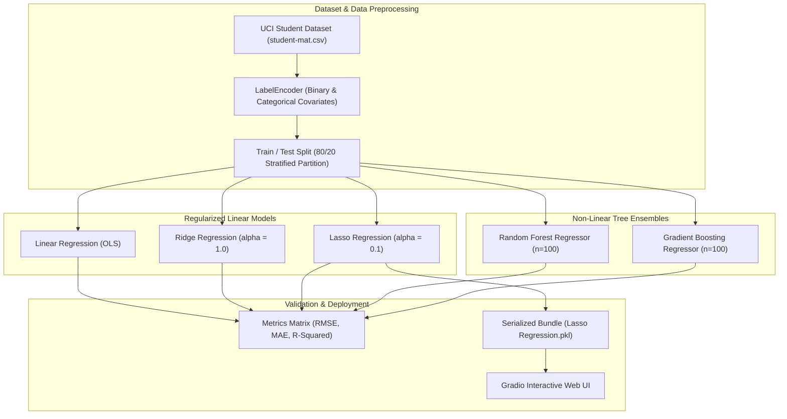

<br/><br/>

<!-- Animated Title -->
<p align="center">
  <a href="#">
    
  </a>
</p>

<p align="center">
  <b>Multi-Model Regression & Educational Data Mining Platform for Academic Grade Prediction</b><br/>
  <i>Regularized Linear Models (Lasso, Ridge) · Tree Ensembles (Random Forest, Gradient Boosting, XGBoost) · UCI Student Performance Dataset · Gradio Deployment</i>
</p>

<br/>

<!-- Badges Row 1: Core Technologies -->
<p align="center">
  
  
  
  
  
</p>

<!-- Badges Row 2: Standards & Status -->
<p align="center">
  
  
  
  
</p>

<br/>

<!-- Quick Navigation Bar -->
<p align="center">
  <a href="#-overview"></a>
  &nbsp;
  <a href="#-problem-statement--academic-solution"></a>
  &nbsp;
  <a href="#-benchmarked-regressors"></a>
  &nbsp;
  <a href="#%EF%B8%8F-system-architecture"></a>
  &nbsp;
  <a href="#-feature-engineering--socio-academic-factors"></a>
  &nbsp;
  <a href="#-quickstart--execution"></a>
</p>

---

## 📌 Overview

**Student Final Grade Prediction** is an educational data mining (EDM) machine learning system engineered to predict a student's final academic grade ($G_3 \in [0, 20]$) in secondary school mathematics. By identifying early warning signs of academic underperformance prior to end-of-term examinations, the platform empowers teachers, guidance counselors, and parents to deliver targeted educational interventions.

Trained on the benchmark **UCI Student Performance Dataset**, the platform conducts an exhaustive empirical benchmark across **five regression architectures**:
- **Lasso Regression (L1 Penalty)** — Serves as both an accurate predictor and an embedded sparse feature selector (`Lasso Regression.pkl`).
- **Ridge Regression (L2 Penalty)** — Shrinks collinear demographic and family background coefficients.
- **Ordinary Least Squares (Linear Regression)** — Interpretable parametric baseline.
- **Random Forest Regressor** — Multi-tree non-linear ensemble.
- **Gradient Boosting Regressor** — Sequential residual-correcting boosted trees.

```
                     ┌────────────────────────────────────────────────────────┐
                     │              Student Performance Engine                │
                     │                                                        │
[ Student Profile:  ]┼──> [ Label Encoding & Covariate Alignment ]            ├──> [ Final Grade Score ]
[ Study, Past Grades]│             │                                          │    - Predicted G3 (0 to 20)
                     │             ▼                                          │    - RMSE / MAE Performance
                     │    [ Multi-Model Regression Benchmark ]                │    - High-Risk Drop Warning
                     │       ├── Lasso Regression (L1 Sparse Selector)        │    - Gradio Interactive UI
                     │       ├── Ridge Regression (L2 Collinear Regularizer)  │
                     │       ├── Random Forest & Gradient Boosting Regressors │
                     │       └── XGBoost Regressor                            │
                     └────────────────────────────────────────────────────────┘
```

---

## 🎯 Problem Statement & Academic Solution

<table>
<tr>
<td width="50%" valign="top">

### ❌ The Academic Attrition Dilemma

Educational institutions struggle to proactively identify struggling students:

- ⏳ **Delayed Discovery**: Final grades ($G_3$) arrive at the end of the term when it is too late for remedial coaching.
- 🧩 **Multifaceted Influences**: Academic success is driven not only by prior marks ($G_1, G_2$), but by family structure, study time, alcohol consumption, and parental education.
- 📉 **Overfitting on Small Cohorts**: Secondary school samples often suffer from high feature correlation (e.g. mother and father education levels).

</td>
<td width="50%" valign="top">

### ✅ The Predictive Analytics Solution

| Challenge | Applied Engineering Solution |
| :--- | :--- |
| **Early Warning System** | Forecasts continuous examination scores $G_3 \in [0, 20]$ early in the semester. |
| **Feature Sparsity** | **Lasso Regression ($\alpha=0.1$)** zeroes out irrelevant attributes, isolating dominant academic predictors. |
| **Non-Linear Benchmarks** | **Random Forest & Gradient Boosting** map non-linear absences and study-time saturation points. |
| **Interactive Deployment** | **Gradio** web interface allowing counselors to input student variables and view projected grades. |

</td>
</tr>
</table>

---

## 🔥 Benchmarked Regressors

| Model Class | Algorithm | Strengths & Evaluation Metrics |
| :--- | :--- | :--- |
| **Linear (L1)** | **Lasso Regression** | Automatically drives non-informative socio-economic weights to zero; robust against collinearity. |
| **Linear (L2)** | **Ridge Regression** | Penalizes extreme weights while preserving all features; stable variance under small samples. |
| **Parametric** | **Linear Regression (OLS)** | Standard unbiased baseline; transparent regression coefficient slopes for each academic factor. |
| **Ensemble** | **Random Forest Regressor** | Bagging ensemble averaging 100 decision trees; captures complex thresholds in absences and failures. |
| **Boosting** | **Gradient Boosting Regressor** | Sequentially minimizes residual squared errors; captures subtle edge cases in top and failing students. |

---

## 🏗️ System Architecture



---

## 🔬 Feature Engineering & Socio-Academic Factors

The predictive matrix encodes four critical domains:
1. **Academic Performance**: First period grade ($G_1$), second period grade ($G_2$), prior course failures (`failures`).
2. **Family & Social Background**: Mother's education (`Medu`), Father's education (`Fedu`), parents' cohabitation status (`Pstatus`), family educational support (`famsup`).
3. **Behavioral & Lifestyle**: Weekly study time (`studytime`), school absences (`absences`), weekday/weekend alcohol consumption (`Dalc`, `Walc`), romantic relationships (`romantic`).
4. **School & Environmental**: School choice reason (`reason`), internet access at home (`internet`), extra educational support (`schoolsup`).

---

## ⚙️ Technical Stack

| Component | Technology | Purpose & Implementation |
| :--- | :--- | :--- |
| **Language** | **Python 3.10+** | Scientific computing runtime |
| **ML Framework** | **Scikit-Learn** | LinearRegression, Ridge, Lasso, RandomForest, GradientBoosting, metrics |
| **Gradient Boosting** | **XGBoost** | High-performance boosted decision trees |
| **Interactive UI** | **Gradio** | Fast prototyping and interactive prediction interface |
| **Data Handling** | **Pandas & NumPy** | Data wrangling, categorical encoding, and vector operations |
| **Visualization** | **Seaborn, Matplotlib & Plotly** | Academic grade distributions and correlation matrices |

---

## 📁 Repository Structure

```
Student-Final-Grade-Prediction/
├── 📄 student-final-grade-prediction.ipynb # Complete 56-cell EDA, modeling & evaluation notebook
├── 📄 Lasso Regression.pkl                 # Serialized trained Lasso Regression model
├── 📊 student-mat.csv                      # UCI Student Performance math dataset
└── 📄 README.md                            # Documentation
```

---

## 🚀 Quickstart & Execution

### Prerequisites
- **Python**: 3.10 or higher
- **Jupyter Notebook**: Recommended

---

### 1. Installation

```bash
# 1. Clone repository
git clone https://github.com/IbrahimAbdelsattar/Student-Final-Grade-Prediction.git
cd Student-Final-Grade-Prediction

# 2. Create virtual environment
python -m venv venv
source venv/bin/activate        # On Windows: .\venv\Scripts\activate

# 3. Install packages
pip install numpy pandas scikit-learn seaborn matplotlib plotly gradio joblib jupyter
```

---

### 2. Running the Analytical Notebook

```bash
jupyter notebook student-final-grade-prediction.ipynb
```

*Execute the notebook cells to train all five regression algorithms, compare RMSE / $R^2$ scores, and launch the interactive Gradio interface.*

---

## 👥 Author & Connect

**Ibrahim Abdelsattar**  
*AI Engineer & Machine Learning Specialist*

- 🌐 **GitHub**: [@IbrahimAbdelsattar](https://github.com/IbrahimAbdelsattar)
- 💼 **LinkedIn**: [Ibrahim Abdelsattar](https://www.linkedin.com/in/ibrahim-abdelsattar/)
- 📧 **Email**: [ibrahimabdelsattar042@gmail.com](mailto:ibrahimabdelsattar042@gmail.com)

---

<p align="center">
  <sub>Engineered for educational data mining, predictive analytics, and academic retention. © 2026 Student Grade Prediction.</sub>
</p>
